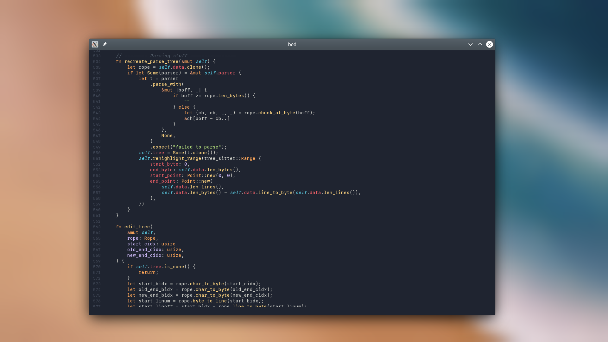

# Barua's EDitor

A not-very-hackable text editor that I am writing for my personal use.

Current features -

- Vim-style modal editing (currently a small subset)
- Syntax highlighting with [Tree Sitter](https://tree-sitter.github.io/tree-sitter/)
- JSON config file and theme specification format

Here's what it looks like, editing its own source code -

